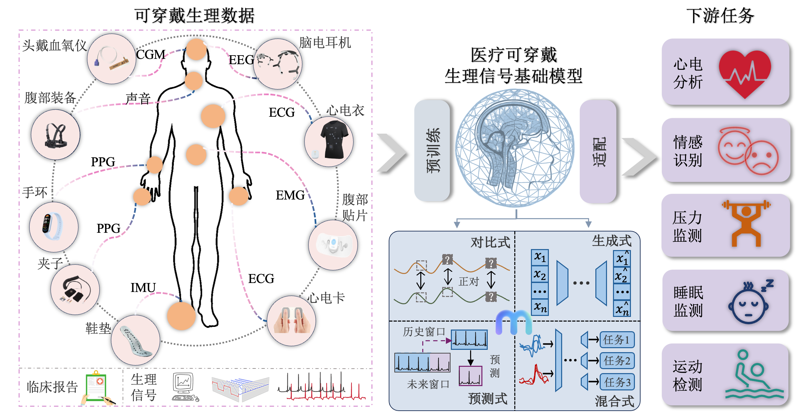

# 可穿戴信号的基础模型建模范式算法研究综述

## 摘要

基础模型的快速发展从根本上重塑了可穿戴生理序列建模范式，并在多种下游任务中带来了显著性能提升。这类方法通常通过预训练或微调基础模型，以获取能够迁移至心电图、脑电图、惯性测量单元、光电容积描记以及多类可穿戴感知信号等生理序列任务的泛化知识。这些生理序列构成了人体生理与行为“语言”，在多种临床环境中具有丰富的诊断与预后价值。本综述旨在对可穿戴生理序列基础模型提供全面、系统且最新的研究脉络总结。尽管已有综述分别从医疗影像方面、时间序列方面以及生理信号数据层面对基础模型进行了讨论，但仍缺乏对方法论范式的核心机制的深入剖析，即基础模型为何能够在可穿戴生理序列任务中发挥作用，以及其背后如何实现有效提升。为弥补这一空白，本文采用方法学范式为核心的分类视角，对可穿戴生理序列基础模型的关键组成要素进行系统化全景梳理，包括：基础模型的演化，模型架构，预训练范式，适配范式，数据模态以及应用场景等，进一步地，我们选取了不同预训练范式在四类不同领域数据集（ECG，EEG，IMU，EOG）上开展了大规模的实验，系统地分析了不同预训练策略对可穿戴序列的优势与不足。

    

## 数据集
以下是本项目所使用的各类生理信号数据集：

### 脑电数据集
* [FaceDetection](https://www.timeseriesclassification.com/description.php?Dataset=FaceDetection)
* [FingerMovements](https://www.timeseriesclassification.com/description.php?Dataset=FingerMovements)
* [HandMovementDirection](https://www.timeseriesclassification.com/description.php?Dataset=HandMovementDirection) 
* [MotorImagery](https://www.timeseriesclassification.com/description.php?Dataset=MotorImagery)
* [SelfRegulationSCP1](https://www.timeseriesclassification.com/description.php?Dataset=SelfRegulationSCP1)
* [SelfRegulationSCP2](https://www.timeseriesclassification.com/description.php?Dataset=SelfRegulationSCP2)

### 心电数据集
* [ECG200](https://www.timeseriesclassification.com/description.php?Dataset=ECG200)
* [CinCECGTorso](https://www.timeseriesclassification.com/description.php?Dataset=CinCECGTorso)
* [ECG5000](https://www.timeseriesclassification.com/description.php?Dataset=ECG5000)
* [ECGFiveDays](https://www.timeseriesclassification.com/description.php?Dataset=ECGFiveDays)
* [NonInvasiveFetalECGThorax1](https://www.timeseriesclassification.com/description.php?Dataset=NonInvasiveFetalECGThorax1)
* [NonInvasiveFetalECGThorax2](https://www.timeseriesclassification.com/description.php?Dataset=NonInvasiveFetalECGThorax2)

### 惯性测量单元数据集
* [CricketX](https://www.timeseriesclassification.com/description.php?Dataset=CricketX) 
* [CricketY](https://www.timeseriesclassification.com/description.php?Dataset=CricketY)
* [CricketZ](https://www.timeseriesclassification.com/description.php?Dataset=CricketZ) 
* [GunPoint](https://www.timeseriesclassification.com/description.php?Dataset=GunPoint) 
* [InlineSkate](https://www.timeseriesclassification.com/description.php?Dataset=InlineSkate) 
* [ToeSegmentation1](https://www.timeseriesclassification.com/description.php?Dataset=ToeSegmentation1) 
* [ToeSegmentation2](https://www.timeseriesclassification.com/description.php?Dataset=ToeSegmentation2) 
* [UWaveGestureLibraryAll](https://www.timeseriesclassification.com/description.php?Dataset=UWaveGestureLibraryAll) 
* [UWaveGestureLibraryX](https://www.timeseriesclassification.com/description.php?Dataset=UWaveGestureLibraryX) 
* [UWaveGestureLibraryY](https://www.timeseriesclassification.com/description.php?Dataset=UWaveGestureLibraryY)
* [UWaveGestureLibraryZ](https://www.timeseriesclassification.com/description.php?Dataset=UWaveGestureLibraryZ)
* [GesturePebbleZ](https://www.timeseriesclassification.com/description.php?Dataset=GesturePebbleZ)

### 多模态数据集
* [128 UCR datasets](https://www.cs.ucr.edu/~eamonn/time_series_data_2018/UCRArchive_2018.zip)
* [30 UEA datasets](https://www.timeseriesclassification.com/index.php)

## 对比式预训练模型
- [x] [T-Loss](https://github.com/White-Link/UnsupervisedScalableRepresentationLearningTimeSeries)
- [x] [SelfTime](https://github.com/haoyfan/SelfTime)
- [x] [TS-TCC](https://github.com/emadeldeen24/TS-TCC)
- [x] [TS2Vec](https://github.com/zhihanyue/ts2vec)
## 生成式预训练模型
- [x] [TST](https://github.com/gzerveas/mvts_transformer)
- [x] [PatchTST](https://github.com/yuqinie98/PatchTST)
- [x] [GPT4TS](https://github.com/DAMO-DI-ML/NeurIPS2023-One-Fits-All)
## 预测式预训练模型
- [x] [TimesNet](https://github.com/thuml/TimesNet)

详细信息请参考[ts_anomaly_detection_methods/README](https://github.com/qianlima-lab/transfer-to-transformer-tsm/blob/master/ts_anomaly_detection_methods/README.md).

## 致谢
我们感谢匿名审稿人所提供的宝贵意见。
我们感谢来自UCR的Eamonn Keogh教授，以及所有为UCR&UEA时间序列库和其他时间序列数据集作出贡献的研究者们，相关代码将在录取后陆续公开。

